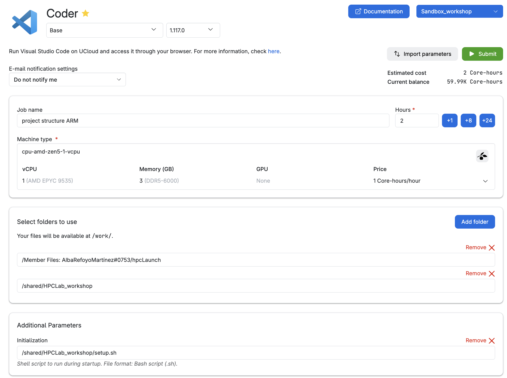
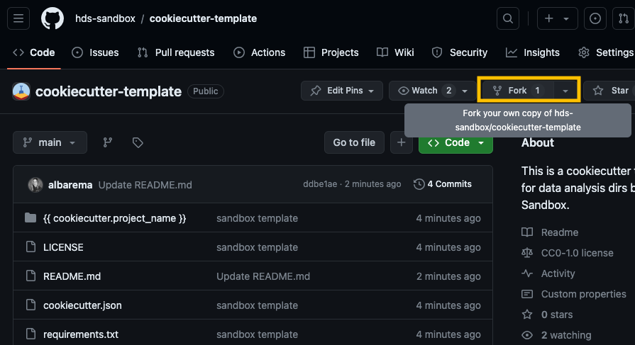

```{r,include=FALSE, results='asis'}
source("_setup.R")
```

:::{.callout-warning}
# Start a new job using Coder on UCloud. 

Please submit a new job to UCloud, mounting your **hpcLaunch** folder in personal drive and using the initialization script provided by the course instructors. Search for the the `Coder` application (you might be familiar with its original name, Visual Studio Code, shown in the image above) using the search bar. Make the app your favorite.

Follow these steps to configure the settings: 

1. Name and version of the app to run: `Coder - 1.117.0`. 
2. Job settings: enter a job name (descriptive of the task), select the time (in hours) we want to use a node for (it can be modified afterward!), and the machine type (selecting a 1 CPU standard node with 3GB memory).
  - Job description in the example: task + user's initials 
3. Add folders to access while in this job (select your own drive!)
  - You need access to our shared folder so that you can get the correct software environment and other material for the exercises (shared/HPCLab_workshop).
  - You need to select your hpcLaunch in your own drive, to save any output from the exercise! You won't have writing permissions on our shared drive. 
4. Optional Parameters. Choose `shared/HPCLab_workshop/setup.sh` as the initialization file.
5. Click on the Submit button (and wait!)

Once the Coder app is running, open a new terminal. 


:::

Let's start with some practical exercises focused on implementing tools that will help you with the collect & document data life cycle phase. 

## Data structure with Cookiecutter

Establishing a consistent file structure and naming conventions will help you efficiently manage your data. We will classify your data and data analyses into two distinct types of folders to ensure the data can be used and shared by many lab members while preventing modifications by any individual:

- Data folders: store raw and processed datasets, the workflow/pipeline used, data provenance, and quality control reports. These folders should be locked and read-only to prevent changes, with MD5 checksums used to verify data integrity.
- Project folders:  contain all necessary files for a specific research project (scripts, results, intermediate files, etc.)


### Setting up folder templates 

Creating a folder template is straightforward with [cookiecutter](https://github.com/cookiecutter/cookiecutter) a command-line tool that generates projects from templates (called cookiecutters). You can do it from scratch (see Bonus) or opt for one of our pre-made templates available as a Github repository (recommended for this workshop). 

Let’s give it a try!

:::{.callout-exercise}
# Exercise 1: Get familiar with Cookiecutter

Create a new subdirectory `day2` under hpcLaunch and make it your WD! 

1. Use our cookiecuter-template to create a project directory
Run this command which will initiate an interactive prompt. Fill up the variables!
```{.bash filename="Terminal"}
cookiecutter https://github.com/hds-sandbox/cookiecutter-template
```

2. Explore the project structure (e.g., `tree`)
:::

You're ready to customize your own template! Explore the following folder structure and the types of files you might encounter. How does it compare to your own setup?

```{.bash filename="Project folder structure"}
<project>_<keyword>_YYYYMMDD
├── data                    # symlinks or shortcuts to the actual data files 
│  └── <ID>_<keyword>_YYYYMMDD
├── documents               # docs and files relevant to the project 
│  └── research_project_template.docx
├── metadata.yml            # variables or key descriptors of the project or data
├── notebooks               # notebooks containing the data analysis
│  └── 01_data_processing.rmd
│  └── 02_data_analysis.rmd
│  └── 03_data_visualization.rmd
├── README.md               # detailed description of the project
├── reports                 # notebooks rendered as HTML/PDF for sharing 
│  └── 01_data_processing.html
│  └── 02_data_analysis.html
│  ├── 03_data_visualization.html
│  │  └── figures
│  │  └── tables
├── requirements.txt // env.yaml # file listing necessary software, libs and deps
├── results                 # output from analyses, figs and tables
│  ├── figures
│  │  └── 02_data_analysis/
│  │    └── heatmap_sampleCor_20230102.png
│  ├── tables
│  │  └── 02_data_analysis/
│  │    └── DEA_treat-control_LFC1_p01.tsv
│  │    └── SumStats_sampleCor_20230102.tsv
├── pipeline                # pipeline scripts 
│  ├── rules // processes 
│  │  └── step1_data_processing.smk
│  └── pipeline.md
├── scratch                 # temporary files or workspace for dev 
└── scripts                 # other scripts 
```

:::{.callout-warning collapse="true"}
# Exercise 2 for non-GitHub users
If you haven’t created a GitHub account or are not comfortable using it yet, you can skip step 1 in Exercise 2 (below). In step 2, use the sandbox URL instead of your owned forked repo by running the following command:

```{.bash filename="Terminal"}
git clone https://github.com/hds-sandbox/cookiecutter-template
```
If you have a GitHub Desktop, click *Add* and select *Clone repository* from the options.

:::

:::{.callout-exercise}

# Exercise 2: Use and adapt the Sandbox template

You will first fork our Sandbox repository, and then clone it to UCloud. This allows you to customize the template to fit your specific needs, rather than strictly following our example, and save the changes back to your repository.
    
1. Go to our [Cookicutter template](https://github.com/hds-sandbox/cookiecutter-template) and click on the **Fork** button at the top-right corner of the repository page to create a copy of the repository on your own GitHub account.

    
2. Go back to the Coder app on UCloud and copy the URL of your fork and **clone** the repository to your personal drive on UCloud (the URL should look something like https://github.com/your_username/cookiecutter-template):

    ```{.bash}
    git clone <your URL to the template>
    ```

3. Access the cloned repository (`cd cookiecutter-template`) and navigate through the different subdirectories.

4. The Cookiecutter template you just cloned is missing the `reports` directory and the `requirements.txt` file. Create these, along with a subdirectory named `reports/figures`. 

    ```plaintext
    │...
    ├── reports/
    │   ├── figures/
    ├── requirements.txt
    ```

:::{.callout-hint}
Here’s an example of how to do it. Open your terminal and navigate to your template directory

```{.bash}
cd \{\{\ cookiecutter.project_name\ \}\}/  
mkdir reports 
touch requirements.txt
...
```
:::

**Feel free to customize the template further to fit your project's requirements**. You can change files, add new ones, remove existing ones or adjust the folder structure. For inspiration, review the data structure under 'Project folder structure' above. 

5. Utilize the template

```{.bash filename="Terminal"}
cookiecutter cookiecutter-template
```

The command `cookiecutter cookiecutter-template` will initiate again an interactive prompt. Fill up the variables and verify that the new structure (and folders) looks like you would expect. Have any new folders been added, or have some been removed?

```{.bash filename="Example bash commands"}
# Assuming the name of the project is 'myproject_may26'
tree myproject_may26 
```

**Optional (if you have time)**

The following steps enable version control and make it easy to share the structure with other members of your lab.

6. Commit and push changes when you are done with your modifications.
- Stage the changes with `git add`.
- Commit the changes with a meaningful commit message `git commit -m "update cookicutter template" `.
- Push the changes to your forked repository on Github `git push origin main` (or the appropriate branch name).

7. Use cookiecutter on the new template! `cookiecutter <URL to your GitHub repository "cookicutter-template">`
:::

If you’ve completed the tasks quickly and have time left, feel free to tackle the optional final exercise.

:::{.callout-tip collapse="true" appearance="simple"}
# Bonus exercise 2

Create a template from scratch using this tutorial [scratch](https://cookiecutter.readthedocs.io/en/stable/tutorials/tutorial2.html). Your template can be as basic as the example provided or include a data folder structure with directories for raw data, processed data, and the pipeline used for preprocessing.

```plaintext
my_template/
|-- {{cookiecutter.project_name}}
|   |-- main.py
|-- tests
|   |-- test_{{cookiecutter.project_name}}.py
|-- README.md
```

- Step 1: Create a directory for the template (like the one above).
- Step 2: Write a cookiecutter.json file with variables such as project_name and author.

:::{.callout-hint}
```{.json .code-overflow-wrap}
{
  "project_name": "MyProject",
  "author_name": "Your Name",
  "description": "A short description of your project"
}
```
:::

- Step 3: Set up the folder structure by creating subdirectories and files as needed.
- Step 4: Incorporate cookiecutter variables in the names of files (`test_{{cookiecutter.project_name}}.py`).
- Step 5: Use cookiecutter variables within scripts opr metadata files (e.g., such as printing a message that includes the project name or the metadata file gets automatically populated with the cookiecutter variables),  
:::


## Naming conventions
A well-structured naming system keeps files organized, easy to search, compatible across different systems, and useful for collaboration.

::: {.webex-check .callout-exercise}
# Exercise 3

```{r, results='asis', echo = FALSE}

optsi <- c(
  "a. Grant proposal final.doc",
  answer="b. differential_expression_results_clara.csv",
  "c. sequence_alignment$v1.py")

optsii <- c(
  "d. scripts/data_processing_carlo's.py",
  "e. data/raw_sequences_V#20241111.fasta",
  answer="f. data/gene_annotations_20201107.gff")

optsiii <- c(
  answer=as.character("g. alpha\\~1.0/beta\\~2.0/reg_2024-05-98.tsv"),
  "h. alpha=1.0/beta=2.0/reg_2024-05-98.tsv",
  "i. run_pipeline:20241203.sh")

cat("Q1. Which naming conventions should be used and why?", longmcq(optsi),  longmcq(optsii),longmcq(optsiii))
```

```{r, results='asis', echo = FALSE}
opts1 <- c( "1a. forecast2000122420240724.tsv",
  answer="1b. forecast_2000-12-24_2024-07-24.tsv",
  "1c. forecast_2000_12_24_2024_07_24.tsv")

opts2 <- c(
answer="2a. 01_data_preprocessing.R",
"2b. 1_data_preProcessing.R",
"2c. 01_d4t4_pr3processing.R")

opts3 <- c(
answer="3a. B1_2024-12-12_cond\\~pH7_temp\\~37C.fastq",
"3b. B1.20241212.pH7.37C.fastq",
"3c. b1_2024-12-12_c0nd~pH7_t3mp\\~37C.fastq"
)

cat("Q2. Which file name is more readable?", longmcq(opts1), longmcq(opts2),longmcq(opts3))

```
:::


Regular expressions are an incredibly powerful tool for string manipulation. We recommend checking out [RegexOne](https://regexone.com/) to learn how to create smart file names that will help you parse them more efficiently.


:::{.webex-check .callout-tip appearance="simple"}
# Bonus exercise 3

Which of the regexps below match **ONLY** the filenames shown in bold?

- **rna_seq/2021/03/results/Sample_A123_gene_expression.tsv**
- proteomics/2020/11/Sample_B234_protein_abundance.tsv
- **rna_seq/2021/03/results/Sample_C345_normalized_counts.tsv**
- rna_seq/2021/03/results/Sample_D456_quality_report.log
- metabolomics/2019/05/Sample_E567_metabolite_levels.tsv
- rna_seq/2019/12/Sample_F678_raw_reads.fastq
- **rna_seq/2021/03/results/Sample_G789_transcript_counts.tsv**
- proteomics/2021/02/Sample_H890_protein_quantification.TSV


`rna_seq.*\.tsv` `r torf(TRUE)` 

`.*\.csv` `r torf(FALSE)`

`.*/2021/03/.*\.tsv` `r torf(FALSE)`

`.*Sample_.*_gene_expression.tsv` `r torf(FALSE)`

`rna_seq/2021/03/results/Sample_.*_.*\.tsv` `r torf(TRUE)`
:::
