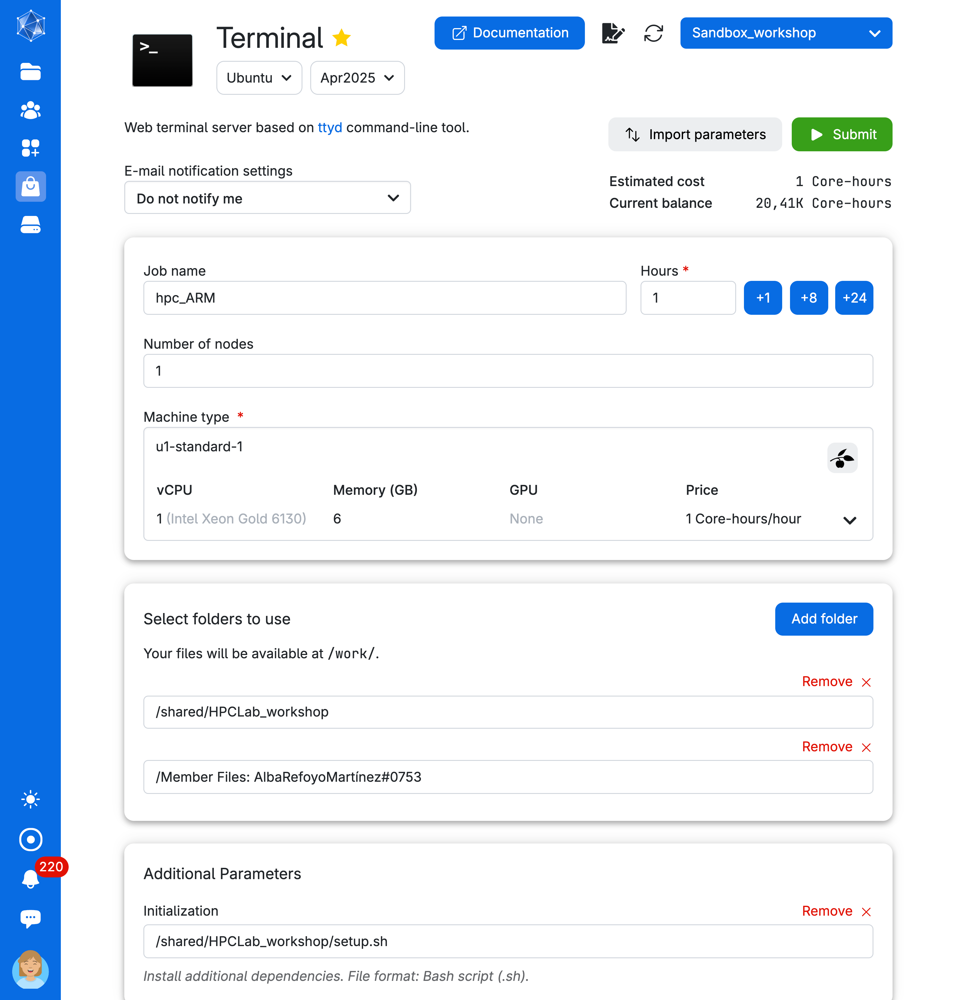

# Managing software 

### 1. Exploring an existing environment

Let's open the Terminal app. Since Conda is not pre-installed in the Terminal app on UCloud, we will need to:  

1. Mount a drive with a pre-installed Miniconda setup.
2. Run a bash script to add conda to the search path.



We will run the following commands to get familiar with Conda environments.

- What is the conda version?

```{.bash}
conda info
```
- Check the name of all the different environments available to you. 

```{.bash}
conda env list
```

- Let's explore one of the environments. To do this, let's activate `hpclab-env` environment

```{.bash}
conda activate hpclab-env
```

- How many packages are available in this environment? 

```{.bash}
conda list |grep -v '#' | wc -l
```

Imagine you need to share your environment with a collaborator so they can replicate your analysis. How do we do this? 

- Export the environment specifications and save them to your personal drive (e.g., <yourname-hpclab>.yml)

```{.bash}
conda env export --from-history > <yourname-hpclab>.yml
```

- Deactivate the environment.

```{.bash}
conda deactivate
```

### 2: Building your conda environment

Let's create a new directory in your personal drive:

```{.bash}
cd <path-to-personal-drive>
mkdir envs 
```

Now, add a new environment using the argument `--prefix PATH` (e.g., `/work/<YourNameSurname#xxxx>/envs/<name-env>`). We need to do this as miniconda is installed in a directory that you don't have write rights to. 

Locally, you would typically run the command: `conda create --name <myenv>`

:::{.callout-warning}
Always specify the location using `--prefix PATH` regardless of the UCloud app you use, especially if the app has conda pre-installed (e.g. Jupyterlab). The path must be on your personal drive or a shared drive with colleagues that you have access to. Otherwise, the environment won't be saved, as you're working within a temporary container instance. 
:::

- Create the environment 

```{.bash}
conda create --prefix /work/<NameSurname#xxxx>/envs/<test-env>
```

- Confirm the environment location

```
Proceed ([y]/n)? y
```

- Double-check that the new environment exists

```{.bash}
conda env list
```
- Activate the env 

```{.bash}
conda activate <myenv>
```
- By default, we won't have conda-forge or bioconda added to the environment. Let's fix this.

```{.bash}
conda config --remove channels defaults
conda config --add channels bioconda 
conda config --add channels conda-forge
```

- Add the latest Python version to the environment
```{.bash filename="Search available versions"}
conda search python 
```

```{.bash filename="Install the latest"}
conda install python=3.13.2 
```
- Install samtools, a tool for manipulating DNA sequencing data

```{.bash}
conda install -c bioconda samtools
```

- Uninstall samtools 
```{.bash}
conda remove samtools 
```

- Deactivate your environment
```{.bash}
conda deactivate
```