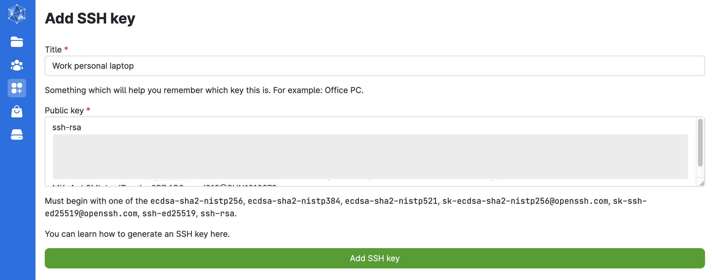
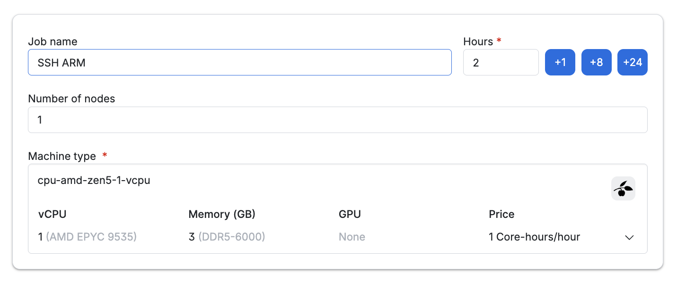
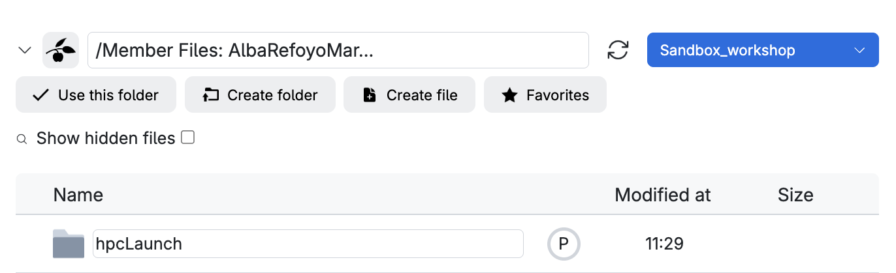
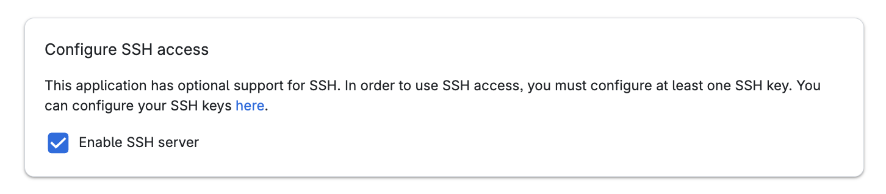
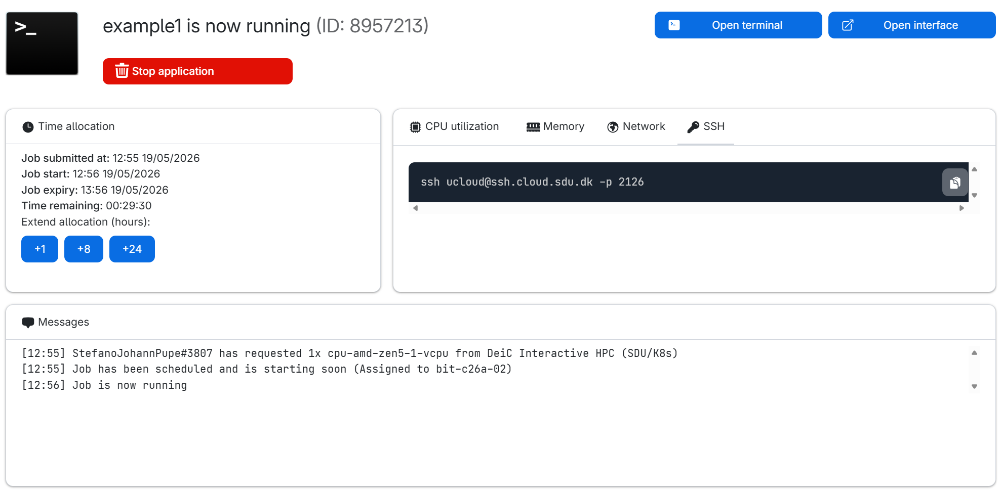

```{r,include=FALSE, results='asis'}
source("_setup.R")
```

## 1. SSH keys

### Local host keys 

Navigate to the location where all SSH keys are stored to generate a new one. Do you have any host keys stored locally?

<span style="color:#F54927;"> **SKIP** these first two commands if you haven't used SSH keys before (the path won't exit if you've never created a key).</span>

```{.bash filename="Mac/Linux"}
cd ~/.ssh 
cat ~/.ssh/known_hosts
```
&#32;
```{.bash filename="Windows"}
cd C:\Users\<YourUsername>\.ssh
cat C:\Users\<YourUsername>\.ssh/known_hosts
```

#### 1.1. Generate SSH Key Pair

We will specify the type of key to create with the option `-t` (default) and use a filename that describes what the key is for (e.g. `id_UCloud`). Don't enter a passphrase (for now!):

```{.bash}
ssh-keygen -t ed25519
```

```
Generating public/private ed25519 key pair.
Enter file in which to save the key (/Users/gsd818/.ssh/id_ed25519): id_UCloud
Your identification has been saved in id_UCloud
Your public key has been saved in id_UCloud.pub
...
```


##### Windows users **only**

:::{.callout-caution collapse="true"}
# Windows: you might need to run a couple more commands!
#### `ssh-keygen` not working?

This might be due to broken permissions. 

When you run the command above and `~/.ssh` does not exist → it is created automatically. IF this didn't happen in your system, run the following command: 
```{.bash}
mkdir -p ~/.ssh
ssh-keygen -t ed25519
```

#### `ssh-agent` service disabled? 
There is one additional thing you need to take care of. By default, the `ssh-agent` service is disabled on Windows, so make sure you're running as an Administrator.

```{.bash filename="On Powershell"}
# Configure it to start automatically.
Set-Service -Name ssh-agent -StartupType Automatic

# Start the service
Start-Service ssh-agent

# This should return a status of Running
Get-Service ssh-agent
```
&#32;

```{.bash filename="On WSL (Windows Subsystem for Linux)"}
eval `ssh-agent -s`
```

On MombaXterm, follow the instructions [here](https://servicedesk.surf.nl/wiki/spaces/WIKI/pages/37388673/Creating+and+using+an+SSH+key+pair+with+MobaXterm).
:::

#### 1.2. Add private key to `ssh-agent`

Once, we have generated your SSH keys, add the key to your system:

```{.bash}
## Now load your key files into ssh-agent
ssh-add id_UCloud
```

Do you get a message similar to this? ``` entity added: id_UCloud (gsd818@SUN1029429) ``` `r torf(TRUE)`

#### 1.3. Copy SSH Key to remote server

Then, copy the public key, either using `cat` to print the content of the file or as follows:

```{.bash}
cat id_UCloud.pub | pbcopy 
````

You can now paste the public SSH key on UCloud. 



You'll need to enable SSH access when you submit a job so you can SSH in. 

### Start a UCloud job with SSH access.

Submit a job from the terminal app and follow these configuration steps (job settings):

1. Enter a job name (descriptive of the task, e.g.: *SSH myname*)
2. Select the time (in hours) we want to use a node for (it can be modified afterwards!). Let's do **2h**.  
3. Number of nodes: 1
4. Machine type: and the machine type (selecting a 1 CPU standard node with 3GB memory). 

{width="900" height="420"}

5. Add folders to access while in this job . We recommend creating a new folder named HPCLaunch in your personal drive, where you can store all files generated during the workshop (e.g.: `/Member Files: username/HPCLaunch`).
{width="900" height="150"}

6. Scroll down and remember to click on  *Enable SSH access*. 

{width="900" height="120"}

Now you are ready to click on the submit button (and wait!). 

Once the job starts, the SSH command appears in the progress view and can be run locally from your terminal (`ssh` in)
{width="900" height="320"}

Copy the command and paste it on your terminal (e.g. `ssh ucloud@ssh.cloud.sdu.dk -p 2396`). 

## 2. Working with files on HPC

### FS navigation and text editors
In this exercise, you will practice working with files and directories on UCloud using the command line. For every task below, you must use **Bash commands** only (no graphical interface). All required commands are very common and widely used in Linux and HPC environments. Check the hints below if you need help.

:::{.warning}
Although we have tried to be flexible in the answers, we may not have included all possible working solutions as correct ones. What matters most is that your code runs correctly and produces the desire output — not that it matches the exact command shown in our solution.
:::

:::{.webex-check .callout-exercise}
# Exercise

1. What is the working directory (wd) on UCloud? Type only the top-level directory (the root level) `r fitb(answer='/work')`
2. Make `hpcLaunch` your wd. Use `pwd` command to print the current wd and copy/paste it here `r fitb(answer='/work/hpcLaunch')`
3. Are there any files in your working directory? `r torf(FALSE)`
4. Create a new directory named `day1` Type the command `r fitb(c('mkdir day1', 'mkdir -p day1'))`
5. Create a new file called `hello.txt` containing the text *Hello* in the **day1** directory?
6. Create an empty file named `emptyFile.csv` in the **day1** directory?
7. Move into the `day1` directory? Type the command `r fitb(answer='cd day1')`
8. Edit the hello.txt file using `nano` or `vim`. Add *Hola* on a new line and save it as a new file (e.g. `greetings.txt`). In nano, use `Ctrl+O` to save with a new filename or `Ctrl+X` to exit/close while choosing to save changes into a new file. 
9. Count lines in both *.txt* files. Use `wc -l <files>`. Type the command `r fitb(c('wc -l *.txt','cat *.txt | wc -l'))`
10. Use a command to list **all** files and their sizes in this directory. Type the command `r fitb(c('ls -lh .','du -sh *'))`
11. Print the first line in `greetings.txt` (only 1!). Use `head` or `awk`. Type the command `r fitb(c('head -n1 greetings.txt', 'head -1 greetings.txt', 'awk \'NR==1\' greetings.txt'),ignore_ws = TRUE)`
12. Print the last command in `greetings.txt` using `tail`. `r fitb(c('tail -n1 greetings.txt', 'tail -1 greetings.txt'),ignore_ws = TRUE)`
13. Can you remove all *.txt* files (specify the file extension when deleting)? Type the command `r fitb(answer='rm *.txt')`

Need some help?


:::{.callout-hint}
Here are some of the commands you need (in random order):

```{.bash}
pwd
head
ls
mkdir
touch
echo
cd
rm
tail
```
:::

:::{.callout-hint}
# Solution 
Run the following commands in a terminal. Make sure you understand what each command does before moving on. 

```{.bash}
# 1. Check the default working directory
pwd

# 2. Change directory 
cd hpcLaunch/

# Check your new current working directory
pwd

# 3. List the contents of your working directory
ls . 

# 4. Create new directory
mkdir -p day1

# 5. Create a text file with content
echo "Hello" > ./day1/hello.txt

# 6. Create an empty file
touch ./day1/emptyFile.txt

# 7. Move into the new directory
cd day1

# 9. Count lines 
wc -l *.txt

# 10. List files and their sizes
ls -lh .

# 11. Print first lines
head -n1 greetings.txt

# 12. Print first lines
tail -n1 greetings.txt

# 13. Remove txt files
rm *.txt

```
:::
:::
