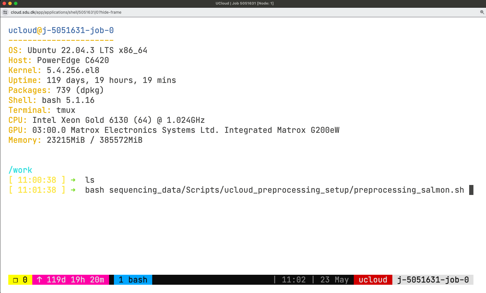

```{r,include=FALSE, results='asis'}
source("_setup.R")
```

## 1. Syncs and transfer with `rsync`

Lots of options you can find in the manual (would require a workshop only for that). Here is the manual if you want to learn more: https://linux.die.net/man/1/rsync. 

Create a folder system locally `hpcLaunch` containing `rsync/data` (in your personal drive) 

```{.bash}
mkdir -p hpcLaunch/rsync/data
cd hpcLaunch/rsync
```

Create 100 files with extensions `fastq` and `log` in the data folder:

```{.bash}
touch data/file{1..100}.fastq data/file{1..100}.log
```

let's check the data dir:
```{.bash}
ls data
```

#### Local-to-local copy

We first use rsync to create a backup copy of the data we just generated. 

:::{.callout-note}
The syntax of `rsync` is pretty simple:

```
rsync OPTIONS ORIGIN(s) DESTINATION
```
:::

An archive (incremental) copy can be done with `-a` option. You can add a progress bar during the transfer with `-P` option. In this exercise, we want to exclude some files from the transfer: we want to keep only those with `fastq` extension. Run the following command:

```{.bash}
rsync -aP --exclude="*.log" data backup
```

This will copy all the `fastq` files in `backup/data`. You can check with `ls`.

:::{.callout-warning}
Using `data` will copy the entire folder, while `data/` will copy only its content! This is common to many other UNIX tools.
:::

Change the first ten `fastq` files with some text:

```{.bash}
for i in {1..10}; do { echo ATGC; echo TCCA; echo NNNN; echo NNNN } >> data/file$i.fastq; done
```

Use `less` file reader. 

:::{.callout-tip}
# Not familiar with `less`?
`less` is ideal for exploring large text files—you can scroll using the arrow keys and exit by pressing q.

Check the documentation (`man less` or `less --help`) to learn how to search for specific text within a file.
:::

Then open the file with `less`, explore its contents, and check which lines contain an **N**.

```{.bash}
less data/file1.fastq
```

While inside `less`, type `/N`. Is some text highlighted? `r torf(TRUE)`

Finally, count how many lines contain at least one N in `file1.fastq`, use the command `grep`. How many are there? `r fitb(2)`


:::{.callout-hint}
# Solution 
```.bash
grep -c 'N' data/file1.fastq
```
:::

Now, we also want to preserve earlier versions of any files that get updated. To do this, create a backup directory named with the current date and time (it will appear in your `backup` directory):

```{.bash}
rsync -aP --exclude="*.log" \
      --backup \
      --backup-dir=versioning_$(date +%F_%T)/ \
      data \
      backup
```

:::{.callout-tip}
If you create a folder called `backup` in your project folder, you can use versioning to store your analysis and results with incremental changes.
:::


#### Transfer between local and remote

You can use the same approach to transfer and back up data between a local machine (your PC/laptop) and another remote system (in this case, UCloud). You need Linux or Mac on the local host to perform `rsync`. 

Let's transfer the `fastq` files to UCloud:

```{.bash}
rsync -aP --exclude="*.log" PATH_TO/data 
```

The opposite can be done uploading data from your computer. For example:

```{.bash}
rsync -aP --exclude="*.log" -e "ssh -i ~/.ssh/id_rsa -p <port>"  PATH_TO/data ucloud@ssh.cloud.sdu.dk:/work/hpcLaunch/data
```

You would have to type your password if you do not make use of `ssh` keys!
---

## 2. Session management using `tmux`

`tmux` was originally designed as a keyboard-only software. However, you can also configure it to allow switching between windows and panes using the mouse. To enable this, add the following setting to the configuration file:

```{.bash}
echo "set -g mouse" >> ~/.tmux.conf
```

You can start a `tmux` session anywhere. It is easier to navigate sessions giving them a name.

1. Start a session called `example1` (or choose a different name!):

```{.bash}
tmux new -s example1
```
The command will set you into the session automatically. The window looks something like below:

{fig-align="center" width=600px}


Now, you are in session `example1` and have one window, which you are using now. 

2. Split the window in multiple terminals. 

Split the window horizontally and vertically, you will be running a total of 3 terminals. 

```
Ctrl + b + %

Ctrl + b + ""

Ctrl+b, then arrow keys to change pane!

```

:::{.callout-tip collapse="true"}
# Using the mouse
- Right-clicked with the mouse to choose the split.
- Left-click to change pane.
-  Right-clicked on the window bar and create a new window.
:::

3. Create a new window with `Ctrl + b + c`
4. Change between windows with `Ctrl+b` then `n`

Now, you have your 2 windows and three panes running in on of them.

In the new window, let's look at which tmux sessions and windows are open. Run

```{.bash}
tmux ls
```

The output will tell you that session `example1` is in use (attached) and has 2 windows.

```
example1: 2 windows (created Wed Apr  2 16:12:54 2025) (attached)
```

:::{.callout-tip collapse="true"}
# Bonus exercise
### Launching separate downloads at the same time
Start a new session without attaching to it (`d` option), and call it `downloads`:

```{.bash}
tmux new-session -d -s downloads
```

verify the session is there with `tmux ls`.

:::{.callout-warning}
If you want a new session attaching to it, you need to detach from the current session with `Ctrl + b + d`.
:::

Create a text file with few example files for this workshop to be downloaded.

```{.bash}
curl -s https://api.github.com/repos/hds-sandbox/GDKworkshops/contents/Examples/rsync | jq -r '.[] | .download_url' > downloads.txt
```

The script below launches all the URLs from the list in the download session in a new window. The new window closes after the download. If there are less than K downloads active, a new one starts, until the end! You can use this and close your terminal. The downloads will keep going and the window names will be shown to keep an eye on the current downloads. Try it out and use it whenever you have massive number of file downloads

```{.bash}
mkdir -p downloaded
K=2  # Maximum number of concurrent downloads
while read -r url; do
    # Wait until the number of active tmux windows in the "downloads" session is less than K
    while [ "$(tmux list-windows -t downloads | wc -l)" -ge "$((K+1))" ]; do     
        sleep 1
    done

    # Extract the filename from the URL
    filename=$(basename "$url")

    # Start a new tmux window for the download
    tmux new-window -t downloads -n "$filename" "wget -c $url -O downloaded/$filename && tmux kill-window"
    tmux list-windows -t downloads -F "#{window_name}"   
done < downloads.txt
```
:::

You are done for now! It's time to stop the job, by holding the `Stop application` button to do so. 

---

## 3. Collect & share using checksums 
We recommend using `md5sum` to verify data integrity, particularly when downloading large datasets, as it is a widely used tool. All data and files archived on Zenodo include an MD5 hash for this purpose. Let's have a look at the content of a newly developed software `fastmixture` that estimates individual ancestry proportions from genotype data. 

:::{.webex-check .callout-exercise}
# Exercise checksums

1. Open this [Zenodo link](https://zenodo.org/records/14106454) 
2. Enter the DOI of the repo (for all versions): `r fitb(answer='10.5281/zenodo.12683371')`
3. Zenodo offers an API at https://zenodo.org/api/, which functions similarly to the DOI API. This allows you to retrieve a BibTeX-formatted reference for a specific record (e.g., `records/14106454`) using either curl or wget.
```{.bash filename="Terminal"}
# ------curl-------
curl -LH 'Accept: application/x-bibtex' https://zenodo.org/api/records/14106454 \
     --output meisner_2024.bib

# ------wget-------
wget --header="Accept: application/x-bibtex" -q \
     https://zenodo.org/api/records/12683372 -O meisner_2024.bib
```

Does the content of your `*.bib` file look like this?
```{.bash}
@misc{meisner_2024_14106454,
  author       = {Meisner, Jonas},
  title        = {Supplemental data for reproducing "Faster model-
                   based estimation of ancestry proportions"},
  month        = nov,
  year         = 2024,
  publisher    = {Zenodo},
  version      = {v0.93.4},
  doi          = {10.5281/zenodo.14106454},
  url          = {https://doi.org/10.5281/zenodo.14106454},
}
```
4. Scroll down to files and download the software zip file (`fastmixture-0.93.4.zip`) using the command below: 

```{.bash filename="Terminal"}
curl https://zenodo.org/records/14106454/files/fastmixture-0.93.4.zip \
--output fastmixture.zip 
```

5. Compute md5 hash and enter the value (no white-spaces) `r fitb(answer='4b3c22644bd2e1dabbbbab599491a7e5')`

6. Is your value tha same as the one shown on zenodo `r torf(TRUE)`

7. Finally, compute the sha256 digest (with program sha256) 
```{.bash} 
sha256sum
```
and enter the value `r fitb(answer='37c931cf669033054333ae6c2553cc936db7a28aa13ab776c5adfb1c932bc72b')`

:::


:::{.callout-tip collapse="true" appearance="simple"}
# Bonus exercise 4

We will be using the HLA database for this exercise. Click on [this link](ftp://ftp.ebi.ac.uk/pub/databases/ipd/imgt/hla/) or google `IMGT HLA> Download`. Important: go through the README before downloading! Check if a checksums file is included. 

1. Download and open the `md5checksum.txt` ([HLA FTP Directory](ftp://ftp.ebi.ac.uk/pub/databases/ipd/imgt/hla/))
2. Look for the hash of the file `hla_prot.fasta`
3. Create a bash script to download the target files (named "dw_resources.sh" in your current directory). 
```{.bash .code-overflow-wrap} 
#!/bin/bash
md5file="md5checksum.txt"

# Define the URL of the files to download
url="ftp://ftp.ebi.ac.uk/pub/databases/ipd/imgt/hla/hla_prot.fasta"

# (Optional 1) Save the original file name: filename=$(basename "$url")
# (Optional 2) Define a different filename to save the downloaded file (`wget -O $out_filename`)
# out_filename = "imgt_hla_prot.fasta"

# Download the file
wget $url --output $out_filename && \
md5sum --quiet --ignore-missing --check $md5file
````
We recommend using the argument `--quiet` as part of your pipeline so that it only prints the errors (it doesn't print output when success). The `--ignore-missing` argument is useful because it allows us to use the raw checksums file while skipping files we may not want to download.

**Did you get any error?** 

4. Generate the md5 hash & compare to the one from the original `md5checksum.txt`. 
:::


## 4. Documentation 

Explore the examples below and consider how effectively the README files communicate key information about the project. Some links point to README files describing databases, while others cover software and tools.

- [1000 Genomes Project](https://ftp.1000genomes.ebi.ac.uk/vol1/ftp/)
- [Homo sapiens, GRCh38](https://ftp.ensembl.org/pub/release-111/fasta/homo_sapiens/dna/README)
- [IPD-IMGT/HLA database](https://github.com/ANHIG/IMGTHLA/blob/Latest/README.md)
- [Pandas package](https://github.com/pandas-dev/pandas)
- [Danish registers](https://www.dst.dk/extranet/forskningvariabellister/Oversigt%20over%20registre.html)

How does your documentation compare to these?


**Done for today!** 