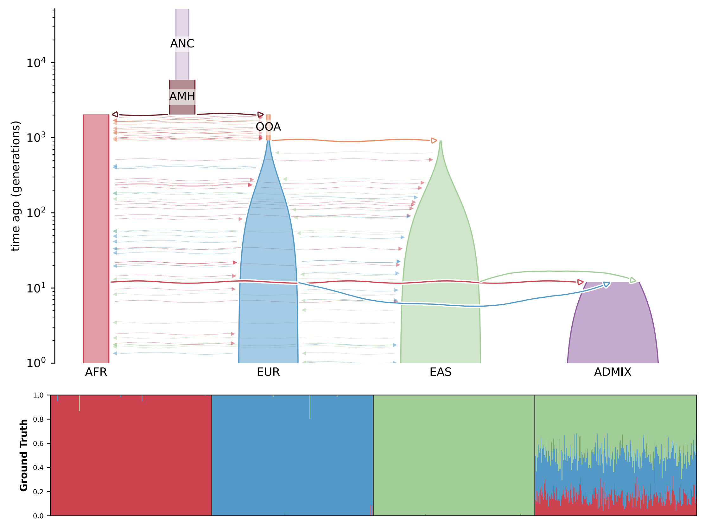

```{r,include=FALSE, results='asis'}
source("_setup.R")
```

Containers are typically used to package applications along with all their dependencies, making them portable and reproducible across different environments. For example, Bioinformatics tools that require complex dependencies or lengthy installations can be distributed as containers, removing the need for manual setup.

Many containers are built using Docker, a widely used container platform. However, Docker is not available on HPCs. Instead, HPCs like GenomeDK, provide Apptainer, which can run containers originally built for Docker. This makes it very practical to pull and integrate containers directly into analysis workflows.

The aim of these exercises is to **understand how to run containerized software**. 

:::{.callout-tip collapse="true"}
# Containers registries

There are several repositories where you can find pre-built containers:

- **[Biocontainers](https://biocontainers.pro)**: community-driven initiative to containerize bioinf softwares (x100K+ container images available) 
- [bioconda package index](https://bioconda.github.io/conda-package_index.html) lists all software versions and how to run it as containers
- **[DockerHub](https://hub.docker.com/)** registry: Public hub for Docker images, often including official containers from software developers
- **[Quay](https://quay.io/)**: another registry similar to DockerHub.
- **[NVIDIA GPU Cloud](https://catalog.ngc.nvidia.com/search?filters=resourceType|Container|container)**
- **[Singularity Cloud Library](https://cloud.sylabs.io/library)
:::

:::{.panel-tabset .tool-tabs}
##  

Apptainer/Singularity was specifically designed for HPC platforms; however, the UCloud server does not support it for regular users.

Select *GenomeDK*, where you can directly run existing Apptainer containers for the exercises. *IF* you haven't created an account on GenomeDK, you have two options: 

- Go to the next section (*recommended*): [Containers - Docker](./pipes-ex-envs-cont-docker.qmd) 
- Run apptainer locally -> click on the computer icon. 

##  

Apptainer (formerly Singularity) was specifically designed for High Performance Computing (HPC) environments. 
First, we’ll walk through the initial setup needed to get started.

### Practical setup 

It’s important to configure a few settings that will automatically be applied each time you log in. Apptainer uses a cache directory to store downloaded container images and related files. By default, this cache is located in your home directory ( `~/.apptainer`). Since HPC home directories often have limited storage, this cache can quickly fill up and cause issues.

To avoid this, we recommend configuring a temporary directory with more available space for Apptainer to use. Add the code below to `~/.bashrc` (use `nano ~/.bashrc` or any editor you want).

```{.bash filename="~/.bashrc"}
mkdir -p -m 700 /tmp/$USER
export APPTAINER_TMPDIR=/tmp/$USER
export APPTAINER_CACHEDIR=/tmp/$USER
```

When creating directories for container use, the `-m 700` option with the mkdir command ensures that only you have access to the files inside. This is particularly important when working with containers that may include passwords or other sensitive data. By restricting permissions, you prevent other users from accessing your files (`/tmp/` is a public folder)! 

Now, create a folder called `containers101` in the `pipesOut` directory.

```{.bash}
mkdir -p pipesOut/containers101
cd pipesOut/containers101
```

::: {.webex-check .callout-exercise}
# Exercise I: Apptainer 

Go to the [Biocontainer Registry](https://biocontainers.pro/registry) and search for a bioinformatics tools you are familiar with. 
- If you are unsure, look for the *minimap2* aligner.
- Open the container page and explore the documentation.
- Identify how the software is typically executed inside a container.

Some software docs will suggest to run immediately the container with `apptainer run`, but we will instead download it first (`pull`) and then run it.

Let's download the image from `minimap2`:

```{.bash}
apptainer pull minimap2.sif https://depot.galaxyproject.org/singularity/minimap2:2.28--h577a1d6_4
```

This command downloads the container into your current directory, and saves it as `minimap2.sif` (better name than the default `minimap2:2.28--h577a1d6_4`). There are two ways of running the container, let's explore both. 

You can launch the container, using the `run` command, which opens a CLI inside the environment. From there, you can manually execute the program and run other commands. 

1. Start the container and enter its environment
2. List the contents of the working directory
3. Create an empty file named `test.txt` in the current directory
4. Verify the file was created. How many files are there now? `r fitb(answer=2)`
5. Check the version of minimap2: `r fitb("^2\\.[0-9]+\\-r[0-9]+$", regex = TRUE)`
6. Exit the container 

Alternatively, you can run the container in a non-interactive way. For workflows and pipelines, it is often more practical to execute commands directly: 

```{.bash}
apptainer run minimap2.sif minimap2
```

- This runs minimap2 immediately and exist immediately after the command has run
- No interactive session is opened
- This approach is ideal for scripting and pipelines

Run the same commands from the exercise above but now in a non-interactively manner. 

- Print minimap2 version using the `exec`
- Delete the `test.txt` file 
- How many files are there now? `r fitb(answer=1)`

When to use each:

- `run`: when testing or exploring a container. It will execute a runscript if one is defined for that container.
- `exec`: in pipelines, scripts, and HPC jobs (this is the most common in practice)
:::

:::{.callout-hint}
# Solution - Apptainer
### Apptainer - interactively 
```{.bash}
# Launch container
apptainer run minimap2.sif

# Run commands
ls 
touch test.txt
ls | wc -l
minimap2 --version
exit 
```

### Apptainer - non-interactive

```{.bash}
apptainer exec minimap2.sif minimap2 --version
apptainer run  minimap2.sif rm test.txt
```
:::


::: {.webex-check .callout-exercise}
# Exercise II: Running a Docker image

In this exercise, we will utilize the `fastmixture` Docker image, which is available on [DockerHub](https://hub.docker.com/r/albarema/fastmixture), the repository for Docker images. To enhance the learning experience, we have chosen a simple genomics analysis, an efficient software tool, [Fastmixture](https://www.biorxiv.org/content/10.1101/2024.07.08.602454v2), and a sample dataset. Focus on executing the commands, ensuring that this approach is easily adaptable to your own projects and software needs.

:::{.callout-hint}
# More on fastmixture software
[Fastmixture](https://www.biorxiv.org/content/10.1101/2024.07.08.602454v2) is a software designed to estimate ancestry proportions in unrelated individuals. It analyses genetic data to determine the percentage of various ancestral backgrounds present in a given individual. This tool is essential for understanding demographic histories and modeling population structure. You can view the results of running such analyses in the figure below.

Here are some optional resources you might typically review before running the software (though not required for this exercise):

- Santander, C.G., Refoyo Martinez, A. and Meisner, J., 2024. Faster model-based estimation of ancestry proportions. Peer Community Journal, 4 [link to paper](https://peercommunityjournal.org/item/10_24072_pcjournal_503)
- Software GitHub repository [link](https://github.com/Rosemeis/fastmixture)

{width=500 fig-align="left"}

:::


1. Pull `fastmixture` image from [DockerHub](https://hub.docker.com/r/albarema/fastmixture) and save it locally as *fastmixture.sif*. Make sure to pull the latest version
2. The input data: `pipes/data/toy`
3. Run a command to display the `fastmixture` version and enter the version number: `r fitb("^(v[0-9])\\.[0-9]+\\.[0-9]+$", regex = TRUE)`
4. Run `fastmixture` software using the command below. We will set *K* to 3 because there are three populations (clusters) in our PCA analysis (exploratory analysis). Both `--bfile` and `--out` require the prefix of a filename, so do not include the file extension. If you have checked the toy folder, you will find the files named `toy.data.*`; therefore, use `--bfile toy.data`

    In `fastmixture`, the main arguments used in this exercise are:

    - `--K`: Specifies the number of ancestral components, representing the sources in the mixture model.
    - `--seed`: Sets the random seed to ensure reproducibility of the analysis across different runs.
    - `--bfile`: prefix for PLINK files (.bed, .bim, .fam).
    - `--out`: Prefix output name.

    ```{.bash}
    fastmixture --bfile <input.prefix> --K 3 --threads 4 --seed 1 --out <output.prefix>
    ```
5. Do you have the results in the toy folder? `r torf(TRUE)` 

You should look for files named `toy.fast.K3.s1.{ext}`, where `{ext}=["Q", "P", "log"]`.

:::


:::{.callout-hint}
# Solution - Running a Docker image

```{.bash}
# Pull image 
apptainer pull fastmixture.sif docker://albarema/fastmixture

# Check version 
apptainer exec fastmixture.sif fastmixture --version 

apptainer exec fastmixture.sif fastmixture --bfile /PATH/TO/toy/toy.data --K 3 --out toy/toy.fast --threads 8

ls toy
```
:::


### Bonus exercises 

You will get to test other containerised tools, for example: 

- [samtools](https://www.htslib.org/doc/samtools.html) (view and convert sam/bam/cram files)
- [BLAST](https://blast.ncbi.nlm.nih.gov/Blast.cgi) (local alignment search tool) 

Alternatively, explore one of the container image repositories and select a tool that you use regularly. Once you have pulled an image, we recommend starting by running the `--help` command, as all software has one. This command displays the help documentation of the program, verifying that our image is functioning correctly and includes the intended software. Don’t hesitate to ask for help if needed!

:::{.callout-tip collapse="true"}
# Bonus 1: samtools 
You can also pull and run a container from DockerHub. Let's try to do so using the `biocontainers/bwa-mem2` container, choose the tag `v1.9-4-deb_cv1`. We will use samtools to view and convert BAM files. Once the image is saved in your wd, use the container to:

- Save image as `samtools_docker.sif`
- Read a `.bam` file from an URL (https://github.com/roryk/tiny-test-data/raw/refs/heads/master/wgs/mt.sorted.bam)
- Use samtools to read the file and save it locally into BAM format (using the `-h` flag to ensure the header is included, and the `-O` to choose the BAM format as input)
- Save the output to a new file called `test01.bam`
- Does your bam file look like this (see below)? `r torf(TRUE)` 


```{.bash}
198d4514-09bb-4f68-bdec-15f2699d3fb9	163	chr1	630214	0	101M	630449	336	CAGTTCTACCGTACAACCCTAACATAACCATTCTTAATCTAACTATTTATATTATCCTAACTACTACCGCATTCCTACTACTCAACTTAAACTCCAGCACC	<@B?@AB@@B:@@A@CABCC@CAAAADACAABCCBAA?CCADACAACBAAAACAACCDBDBDABCAAC;CAABCCDABCABDCADBDCBDCBDD?ADCAB?	NM:i:1	MD:Z:38T62	MC:Z:101M	AS:i:96	XS:i:96	XA:Z:chrM,+5044,101M,1;
```

:::{.callout-hint}
Check the [samtools documentation](https://www.htslib.org/doc/samtools-view.html)

```{.bash}
samtools view -h <bamfile> -O bam 
```

Use `samtools view` to check the first 1-2 lines of the file. 
:::

:::


:::{.callout-hint}
# Solution - samtools

You can find the image path: [https://hub.docker.com/r/biocontainers/samtools](link to samtools).

```{.bash}
# Pull image as .sif
apptainer pull samtools_docker.sif docker://biocontainers/samtools:v1.9-4-deb_cv1
# Run samtools 
apptainer exec samtools_docker.sif \
                samtools view \
                -h https://github.com/roryk/tiny-test-data/raw/refs/heads/master/wgs/mt.sorted.bam \
                -O bam > test01.bam
```


:::

:::{.callout-tip collapse="true"}
# Bonus 2: BLAST 
## BLAST - Build a BLAST protein database from zebrafish protein sequences.

Zebrafish is a widely used model organism in genetics. This small dataset will facilitate quick results, allowing us to focus on how to run different bioinformatics tools so that you can easily adapt the commands in future projects.

1. Download a BLAST container
2. Explore how to run BLAST tools
3. Download a reference dataset (zebrafish proteins)
4. Prepare it as a BLAST database

:::

:::{.callout-hint}
# Solution - BLAST

```{.bash}
apptainer pull docker://biocontainers/blast:2.2.31
apptainer run blast_2.2.31.sif blastp -help
mkdir zebrafish-ref
apptainer run blast_2.2.31.sif curl -O ftp://ftp.ncbi.nih.gov/refseq/D_rerio/mRNA_Prot/zebrafish.1.protein.faa.gz
apptainer run gunzip zebrafish.1.protein.faa.gz
apptainer run blast_2.2.31.sif makeblastdb -in zebrafish.1.protein.faa -dbtype prot
```
:::

:::{.callout-tip collapse="true"}
# Bonus 3: Build your own container
You can build a container directly on genomeDK [using apptainer](https://singularity-tutorial.github.io/03-building/). Create a new project-specific dir, e.g. *jupyter-project*. The image should include jupyter-notebook, and the python libs, matplotlib, pandas and numpy. 
:::

:::{.callout-tip collapse="true"}
# Bonus 4- using GPUs with Apptainer
Apptainer supports GPU acceleration, allowing you to run containerized applications that take advantage of NVIDIA GPUs. Pull tensorflow image and test that it works. *This takes some time*

- https://www.tensorflow.org/install/docker
- https://hub.docker.com/r/tensorflow/tensorflow
:::

:::{.callout-hint}
# Solution - using GPUs with Apptainer
```.bash
# pull image
apptainer pull docker://nvcr.io/nvidia/tensorflow:23.08-tf2-py3

# run the container on GPU node
apptainer run --nv tensorflow_23.08-tf2-py3.sif python3 --version
```
:::


##  

You will need to install a Linux virtual machine to be able to run Apptainer. Follow the instructions [here](https://apptainer.org/docs/admin/main/installation.html#installation-on-windows-or-mac). 

Once you are ready, click on GenomeDK to follow the exercises, but note that the commands must be adapted to run inside a virtual machine. Check the solutions below for an example of how the commands should be modified.

:::{.callout-hint}
# Solution - Running a Docker image

````.bash
# on local machine (using LIMA)

cd toy # from data folder 

apptainer pull /tmp/lima/fastmixture_latest.sif docker:/albarema/fastmixture
apptainer run /tmp/lima/fastmixture_latest.sif fastmixture --bfile toy.data --K 3 --out toy.fast --threads 8
```
:::

:::
